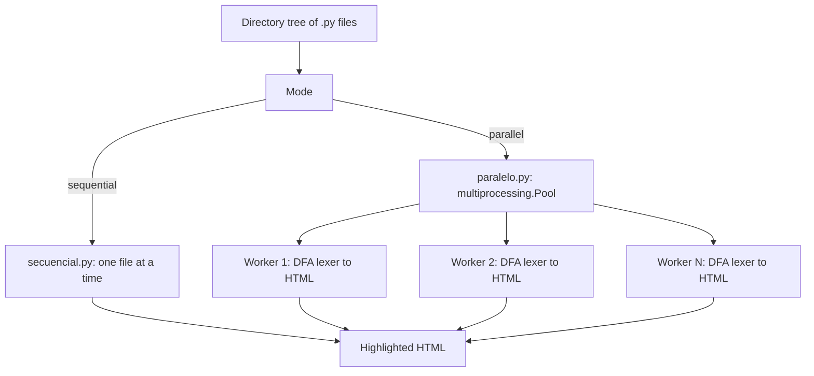
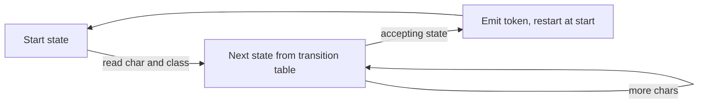

# Parallel Syntax Highlighter

[](https://github.com/sant-mell/parallel-syntax-highlighter/actions/workflows/ci.yml)

A Python syntax highlighter built from scratch on automata theory. It started as a hand-written DFA lexer that classifies Python tokens with an explicit transition table, and then grew into a batch highlighter that renders many files to HTML, with a sequential baseline and a multiprocessing version compared head to head by a benchmark.

The project is split into the two course deliverables that produced it:

- `evidencia-1-dfa-lexer/` is the standalone DFA lexer.
- `evidencia-2-parallel-highlighter/` is the parallel highlighter that builds on it.

## Why it is interesting

- The lexer is a real deterministic finite automaton. Token recognition is driven by a transition table indexed by current state and input column (letter, digit, dot, quote, operator, and so on), not by regular expressions or a library.
- It does genuine lexical analysis: integers, decimals and scientific notation, strings, identifiers and keywords, comments, and operators, including the tricky cases like a `#` inside a string or `//` not being a Python comment.
- The highlighter is parallelized with `multiprocessing.Pool` and measured against a sequential baseline, so the speedup is reported with numbers instead of claimed.

## How it runs in parallel

Both versions do the same work, classify every `.py` file with the DFA lexer and write HTML. The sequential version processes files one by one; the parallel version hands each file to a worker process in a `multiprocessing.Pool`, one task per CPU core.



## Layout

```
evidencia-1-dfa-lexer/
  lexer_dfa_python.py    the DFA lexer and HTML generator for a single file
  DFA_diagrama.svg       the automaton diagram (states and transitions)
  review_case.py         a small input that exercises the edge cases
  review_case.html       the highlighted output for that input
evidencia-2-parallel-highlighter/
  lexer_dfa.py           the lexer used as a module
  secuencial.py          sequential baseline: highlight a directory tree of .py files
  paralelo.py            same work distributed across CPU cores with multiprocessing
  benchmark.py           runs both several times and reports the speedup
  pruebas/               sample .py inputs so the benchmark runs out of the box
docs/
  evidencia-1-report.pdf the written report for the lexer
  evidencia-2-reflexion.pdf the reflection on the parallel version
```

## Running it

Everything runs on Python 3 with the standard library only, no dependencies to install.

### Evidencia 1: the DFA lexer

Highlight a single Python file. The output is an HTML file you can open in a browser.

```
cd evidencia-1-dfa-lexer
python lexer_dfa_python.py review_case.py
```

This writes `review_case.html`. Pass a second argument to choose the output name.

### Evidencia 2: the parallel highlighter

From inside the folder, highlight every `.py` file under one or more directories.

```
cd evidencia-2-parallel-highlighter

# sequential
python secuencial.py pruebas

# parallel, one task per CPU core
python paralelo.py pruebas

# benchmark both and print the speedup
python benchmark.py pruebas
```

`benchmark.py` runs each version five times and prints the per-run and average times plus the speedup. The included `pruebas` folder is only a correctness sample and is too small to show a speedup, because spawning the worker processes costs more than the work itself. To see the parallel version win, generate a larger corpus first:

```
python generar_corpus.py /tmp/corpus 60 400
python benchmark.py /tmp/corpus
```

You can also point the benchmark at any real directory of Python files, for example `python benchmark.py /path/to/some/python/project`.

## Results

On a 16 core machine, highlighting a generated corpus of 60 files (about 8 MB of Python source):

```
Run        Sequential (s)   Parallel (s)   Speedup
1                 11.4168         1.4425     7.914x
2                  7.2256         1.0599     6.818x
3                  6.0013         1.0642     5.639x
4                  5.4562         1.0749     5.076x
5                  5.3923         1.0542     5.115x

Average sequential: 7.10 s
Average parallel:   1.14 s
Average speedup:    6.23x
```

The speedup is well below the 16x core count, and that is the interesting part: the work is I/O and process-spawn bound, not purely CPU bound, so it does not scale linearly. On a tiny input the parallel version is actually slower, because the fixed cost of creating the pool dominates. The win only appears once the work per batch is large enough to amortize that cost, which is the real lesson about when parallelism pays off.

## How the lexer works

The core is a transition table where each row is a state and each column is a class of input character. Reading a character looks up the next state; when the automaton reaches an accepting state it emits a token of the matching type and restarts from the start state. Because the logic lives in the table rather than in branching code, adding or changing a token type is a matter of editing the table, which is the same idea behind real lexer generators.



The full automaton, with every state and transition, is in [`evidencia-1-dfa-lexer/DFA_diagrama.svg`](evidencia-1-dfa-lexer/DFA_diagrama.svg).

## Authors

A team project for a computational methods course at Tecnologico de Monterrey:

- Santiago Aguilar Mello
- Vladimir Pinera Reyes
- Daniela Janet Gil Gonzalez
